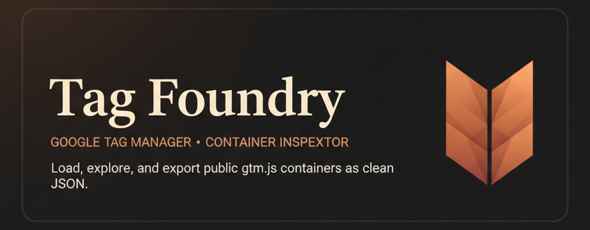
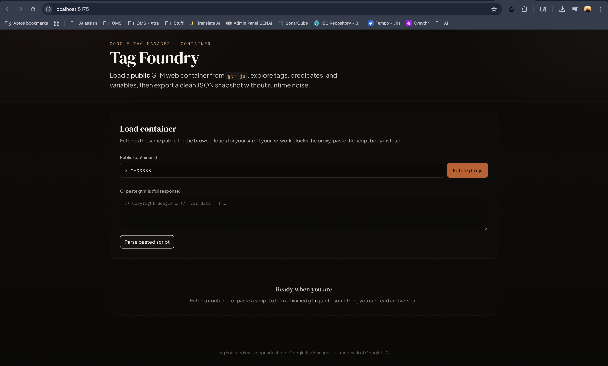
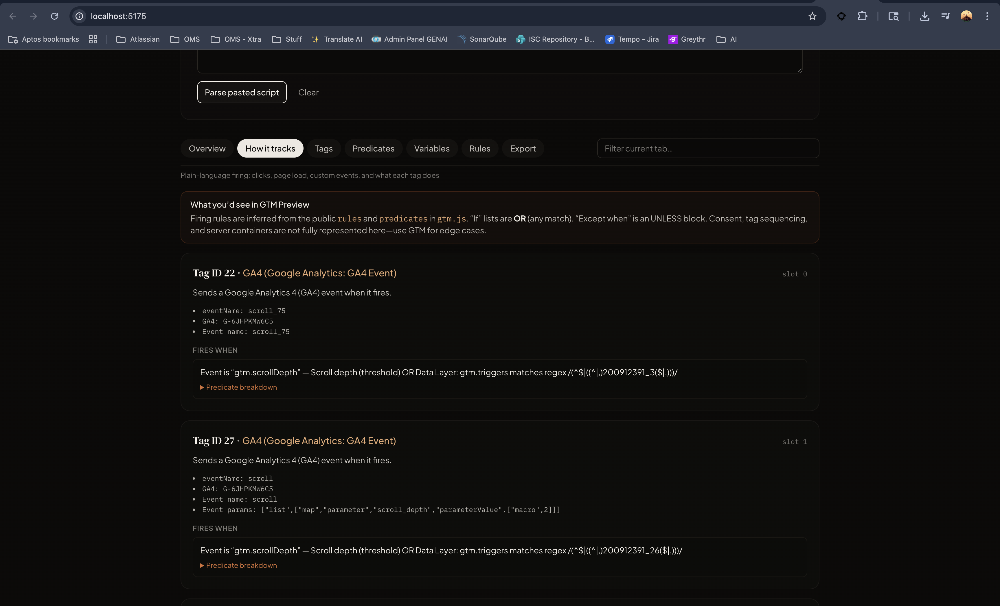

# Tag Foundry

Load a public **Google Tag Manager** web container from `gtm.js`, explore tags, predicates, and variables, and export a clean JSON snapshot.



## Screenshots

### Overview



### How it tracks



## Development

```bash
npm install
npm run dev
```

- **Build:** `npm run build`
- **Preview production build:** `npm run preview`
- **Lint:** `npm run lint`

Static images in `public/` are served at the site root (for example `public/banner.png` → `/banner.png`).

---

*Tag Foundry is an independent tool; Google Tag Manager is a trademark of Google LLC.*
